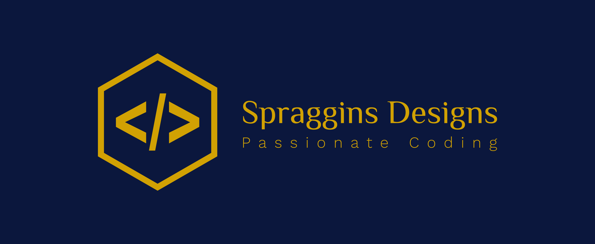

# Battleship Project
I created a Battleship game for my IS30A course in Fall of 2021. It is written entirely in HTML5, CSS3 and JavaScript. 

## How To Play

1. run `git clone https://github.com/spragginsdesigns/Battleship-Game-Project.git`

2. Open the folder in your IDE

3. Using Live Server or whatever else, launch the [AustinSpragginsBattleship.html](https://github.com/spragginsdesigns/Battleship-Game-Project/blob/Spraggins-Designs/AustinSpragginsBattleship.html) file and play. 

4. You have 17 battleships to fire at before the game is complete. 

5. If you click on a sunken battleship, you will be notified. 

6. If you finish all 17 battleships, you win! And you will be notified as well. 

   

## Conclusion

This was created as a final project for my IS30A class at Clovis Community College. Anyone who wants to use the code may use it, but may not sell it or use it to cheat in their class. I just made this public because the final is over now. 

I had a great time writing this, and if anyone would like to contribute to it, go for it or fork it. 

Otherwise, I plan to add a few more features when I have some time. 

